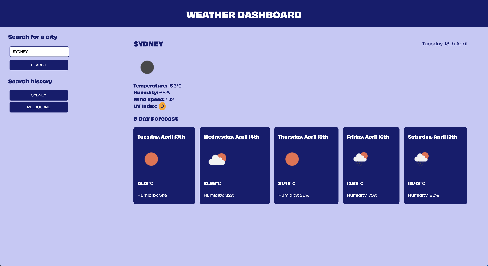

# weather-dashboard
WEEK 06 HW ASSIGNMENT - building a weather dashboard that will run in the browser and feature dynamically updated HTML and CSS


# 06 Server-Side APIs: Weather Dashboard

## The Weather Dashboard

Use the [OpenWeather API](https://openweathermap.org/api) to create a weather dashboard that allows a user to search for a city, and in return receive the current date and weather including temperature, humidity nad UV index, as well as an icon that illustrates the conditions, on top of this the user will be presented with a 5 day forecast.

## User Story

```
AS A traveler
I WANT to see the weather outlook for multiple cities
SO THAT I can plan a trip accordingly
```

## Functionality

```
GIVEN a weather dashboard with form inputs
WHEN I search for a city
THEN I am presented with current and future conditions for that city and that city is added to the search history
WHEN I view current weather conditions for that city
THEN I am presented with the city name, the date, an icon representation of weather conditions, the temperature, the humidity, the wind speed, and the UV index
WHEN I view the UV index
THEN I am presented with a color that indicates whether the conditions are favorable, moderate, or severe
WHEN I view future weather conditions for that city
THEN I am presented with a 5-day forecast that displays the date, an icon representation of weather conditions, the temperature, and the humidity
```

## Issues

```
I was able to get the search history to render to screen when working locally and already having saved the prevSearches to local storage - however there after clearing local storage or viewing on the live site there is an issue with this function that still needs fixing.
```

## Final Site

The following image shows the web application's appearance and functionality:



[Link to deployed site here](https://lauren-briggs.github.io/weather-dashboard/)
